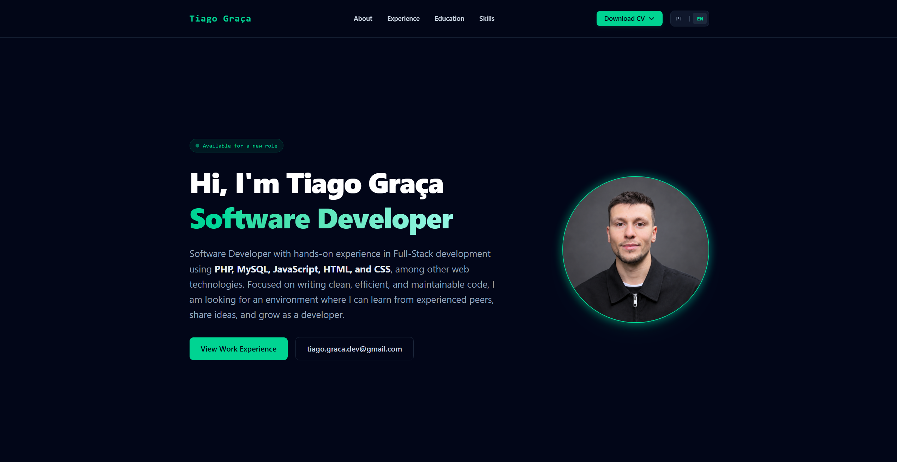

# Tiago Graça · Portfolio

Portfolio pessoal e CV online, responsivo e bilingue (PT/EN), com tema escuro.



🔗 **Demo:** [tiagograca03.github.io/digital_tiago](https://tiagograca03.github.io/digital_tiago/)

## ✨ Funcionalidades

- Design responsivo, de mobile até 4K (escala proporcional acima de 1920x1080)
- Tradução PT/EN em tempo real, sem recarregar a página
- Timeline de experiência profissional
- Download do CV em PDF (botão no header e botão flutuante em mobile)
- Navegação por âncoras com scroll suave

## 🛠️ Tecnologias


## 🚀 Como correr localmente

```bash
git clone https://github.com/TiagoGraca03/digital_tiago.git
cd digital_tiago
npm install
npm run watch
```

Com o `watch` a correr, o Tailwind recompila o CSS sempre que alteras o HTML. Depois abre o `index.html` no browser (ou usa a extensão Live Server).

Para gerar o CSS final minificado:

```bash
npm run build
```

## 📁 Estrutura

```
├── index.html
├── langs.js        # traduções PT/EN
├── img/            # favicon e foto de perfil
├── pdf/            # CV
└── dist/output.css # CSS compilado do Tailwind
```

## 📬 Contacto

[LinkedIn](https://linkedin.com/in/t-graca/) · [GitHub](https://github.com/TiagoGraca03) · tiago.graca.dev@gmail.com